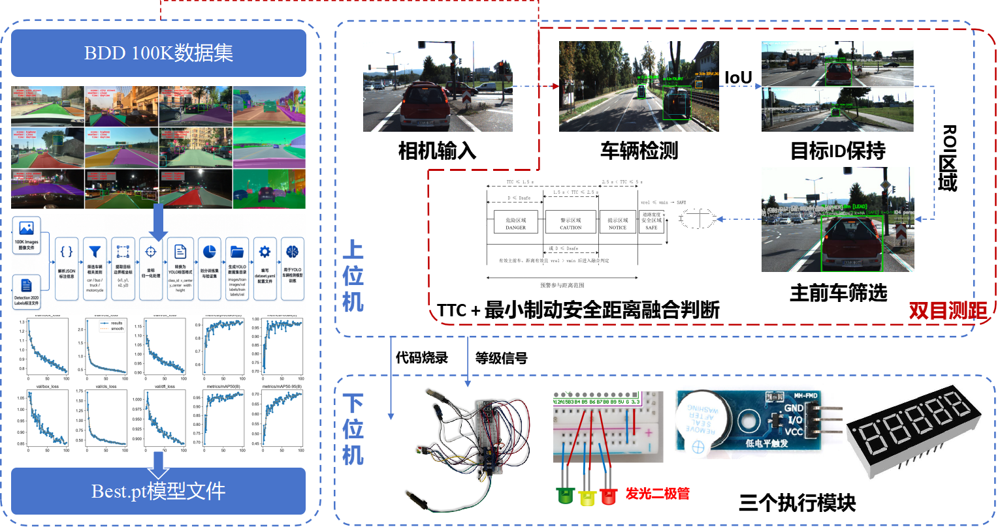
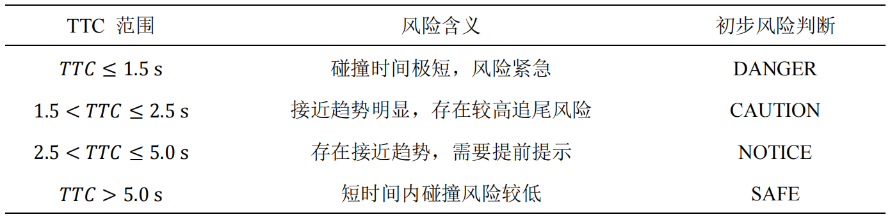
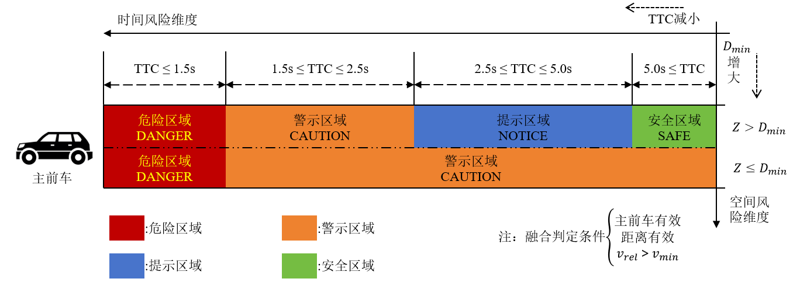

# forward-collision-warning-system
A Forward Collision Warning System based on multi-sensor information fusion, including YOLO vehicle detection, StereoSGBM depth estimation, TTC-based risk assessment and STM32 acoustic-optical warning.

Pure Minimum Braking Safety Distance Model

Pure TTC Model from：GB/T 33577－2017 《智能运输系统车辆前向碰撞预警系统性能要求和测试规程》

Fusion of TTC and Minimum Braking Safety Distance

